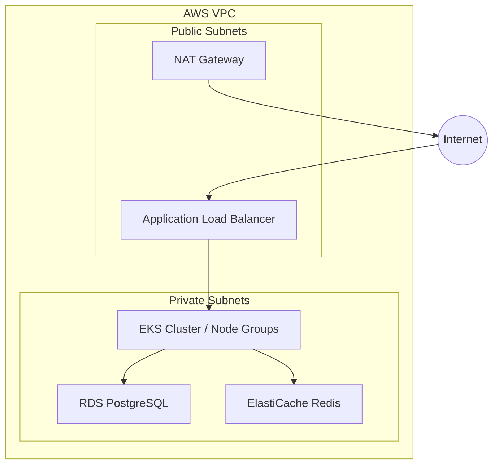

# 🚀 AI Infrastructure Platform on AWS

<p align="center">
  
  
  
</p>

<p align="center">
  
  
  
  
  
</p>

---

## 🌟 Project Overview

This repository provides **production-grade Terraform Infrastructure as Code (IaC)** for a high-performance, scalable AI platform on AWS. It is designed to host GenAI backends, RAG systems, and autonomous agent workloads with enterprise-level security and observability.

### 🎯 Key Capabilities
* 🤖 **AI-Ready Compute:** Managed Amazon EKS with auto-scaling node groups.
* 💾 **Reliable Data Layer:** RDS PostgreSQL for structured data and ElastiCache Redis for lightning-fast caching.
* 🛡️ **Security-First:** Private networking, IAM least-privilege, and encrypted S3 buckets.
* 📊 **Deep Observability:** Integrated CloudWatch logging and custom monitoring dashboards.

---

## 🏗️ High-Level Architecture



---

## 📂 Repository Structure

```bash
terraform-aws-ai-platform/
├── 🏗️ modules/           # Reusable Infrastructure Components
│   ├── vpc/             # Networking & Security Groups
│   ├── eks/             # Kubernetes Cluster & Nodes
│   ├── rds/             # Relational Database
│   ├── redis/           # Distributed Caching
│   ├── s3/              # Object Storage
│   ├── alb/             # Load Balancing
│   └── monitoring/      # CloudWatch & Dashboards
├── 🌍 environments/      # Environment-Specific Deployments
│   ├── dev/             # Development Sandbox
│   ├── staging/         # Pre-Production Testing
│   └── prod/            # Production Workloads
├── 🔐 global/            # Shared Backend Configurations
└── 📖 README.md          # Platform Documentation
```

---

## 🛠️ Deployment Workflow

### 1️⃣ Prerequisites
- [Terraform](https://www.terraform.io/downloads.html) >= 1.0
- [AWS CLI](https://aws.amazon.com/cli/) configured with appropriate credentials
- S3 Bucket & DynamoDB table for [Remote State](https://www.terraform.io/docs/language/settings/backends/s3.html)

### 2️⃣ Initialize & Deploy
Navigate to the desired environment (e.g., `environments/dev`):

```bash
# Initialize Terraform
terraform init

# Review the execution plan
terraform plan -var-file=terraform.tfvars

# Apply the infrastructure
terraform apply -var-file=terraform.tfvars
```

---

## 🛡️ Security Standards
- ✅ **Private Networking:** All data stores and compute nodes reside in private subnets.
- ✅ **Encryption at Rest:** All S3 buckets and RDS instances use AES-256 encryption.
- ✅ **Access Control:** No direct SSH access; all management via AWS SSM or EKS APIs.
- ✅ **State Management:** Remote state is encrypted and locked via DynamoDB.

---

## 👨‍💻 Maintainer
**Madhav Mohan**
*Project: terraform-aws-ai-platform*

---
<p align="center">
  Built with ❤️ for the AI Community
</p>
